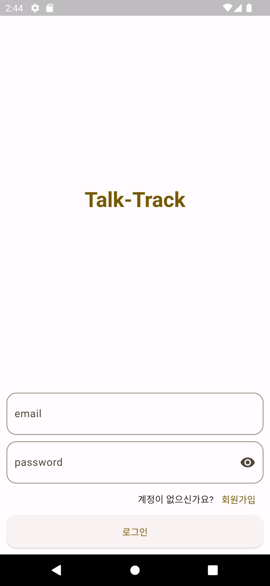
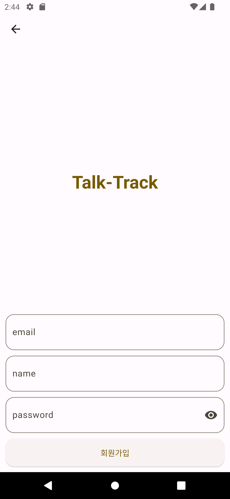
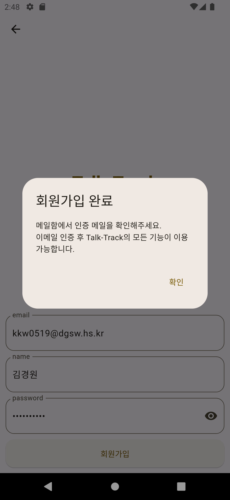
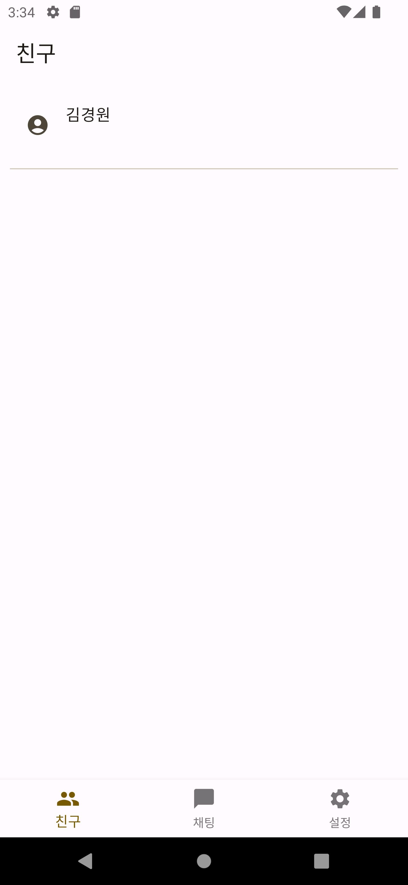
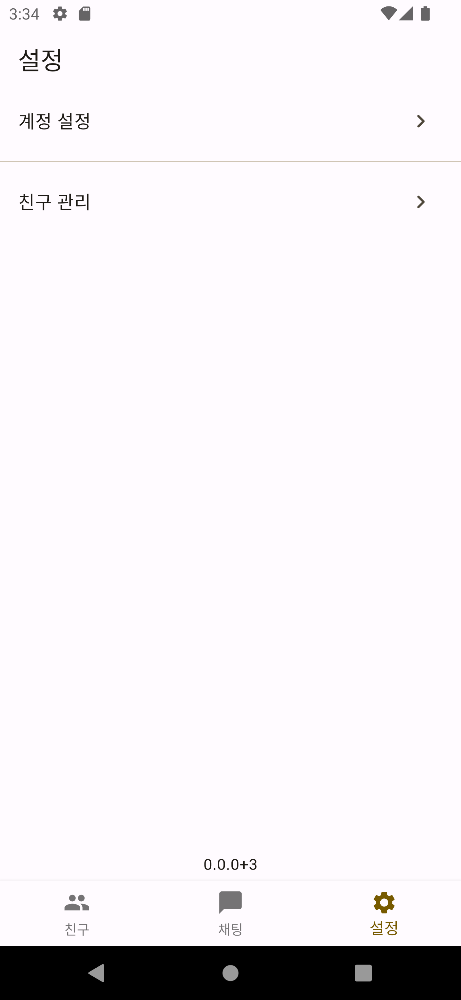
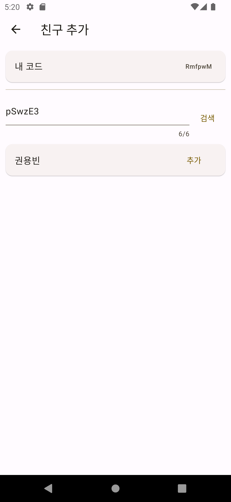
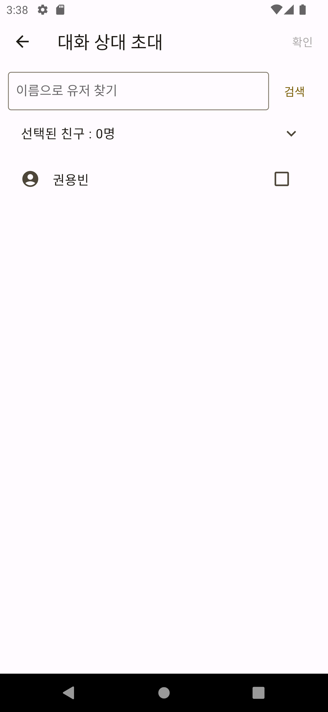
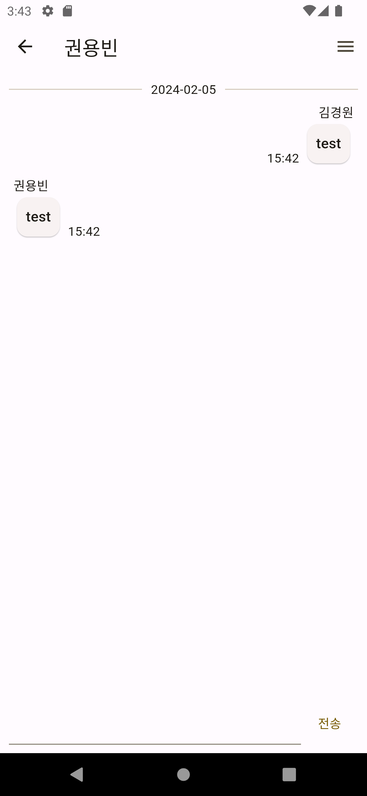

# 프로젝트 요약

Talk-Track은 사용자의 편리한 커뮤니케이션을 지원하는 채팅 애플리케이션입니다. 이 애플리케이션은 사용자가 로그인하고 계정을 만들어 다른 사용자와 메시지를 주고받을 수 있게 해줍니다. 또한, 친구를 추가하고 그룹 채팅을 생성하는 등의 다양한 기능을 제공합니다.

# 프로젝트 준비

프로젝트를 시작하려면 처음에는 필요한 패키지를 가져와야 합니다. 이를 위해 아래의 명령어를 입력해주세요.

```bash
$ flutter pub get
```

이 명령어는 프로젝트에 필요한 모든 패키지를 가져오는 역할을 합니다.

# 프로젝트 개요

- 사용 언어 및 프레임워크
    - Dart : >=3.1.4 <4.0.0
    - Flutter : >=3.10.0
- 아키텍처 패턴
    - Clean Architecture
- 주요 사용 패키지
    - go_router
    - firebase_auth
    - cloud_firestore
    - firebase_core
    - firebase_database
    - flutter_riverpod

이들 패키지는 이 애플리케이션의 주요 기능을 구현하는데 사용되었습니다. 각 패키지는 라우팅, 인증, 데이터베이스 관리 등의 역할을 담당합니다.

# 프로젝트 구조

프로젝트의 구조는 다음과 같습니다:

### 폴더 구조

```bash
- /lib
	- /src
		- /core
			- /constants
				- app_constants.dart # 앱 상수 모음
				- firebase_auth_error_code.dart # 파이어베이스 회원 기능 오류 코드
				- firestore_database_constants.dart # 파이어베이스 파이어스토어 상수 모음
				- realtime_database_constants.dart # 파이어베이스 리얼타임 데이터베이스 상수 모음
				- regexp_source.dart # 정규식
			- /routes
				- app_pages.dart # 라우트 관리
				- app_routes.dart # 라우트 이름
				- app_path_constants.dart # 라우트 상수
			- /utils
				- dialogs.dart # Dialog Widget
				- validator.dart # 유효성 검사
			- /values
				- /exceptions # exception 모음
			- /widgets # 공유 위젯
		- /features
			- /account_management # 계정 관리
			- /auth # 로그인 및 회원가입 기능
			- /chat # 채팅 기능
			- /chats # 채팅 목록 기능
			- /friend_management # 친구 관리 기능
			- /friends # 친구 목록
			- /navigator # 바텀 네비게이터 및 하위 페이지 관리 기능
			- /settings # 설정 기능
		- dependency_injection.dart # 의존성 관리
	main.dart # 프로젝트 메인 함수

```

# 프로젝트 기능

### 로그인/회원가입

이메일을 통해 로그인 및 회원가입을 할 수 있습니다. 회원가입 시 이메일 인증을 통해 해당 이메일이 유효한지 확인합니다. 이메일 인증은 사용자의 신원을 보증하고, 보안을 강화하는 데 중요한 역할을 합니다.

<div align="center">
    
    
    
</div>

### 메인 기능

- **친구**
    - 친구 목록이 표시됩니다. 이 목록에서는 사용자가 추가한 친구의 목록을 확인할 수 있습니다.
- **채팅**
    - 채팅 목록이 표시됩니다. 이 목록에는 사용자가 참여하고 있는 모든 채팅방이 표시됩니다.
- **설정**
    - 설정 목록이 표시됩니다. 사용자는 이 설정에서 계정 설정 및 친구 관리를 할 수 있습니다.

<div align="center">
    
    
    
</div>

### 친구 추가

설정 메뉴 내의 친구 관리 탭에서 친구를 추가할 수 있습니다. 친구 코드를 입력하고 추가 버튼을 누르면 등록됩니다. 이 기능을 통해 사용자는 쉽게 친구를 추가하고 친구와 채팅할 수 있습니다.

<div align="center">
    
    
</div>

### 채팅 시작

채팅 목록 상단에 있는 + 버튼을 누르면 대화 상대 초대 페이지로 이동합니다. 대화 상대 초대 인원은 제한이 없으며, 1명을 초대하면 1:1 채팅, 여러 명을 초대하면 그룹 채팅이 됩니다. 그룹 채팅의 경우 채팅방 이름을 따로 설정해야 합니다.

<div align="center">
    
    
</div>

### 채팅

<div align="center" style="display:flex;">
    <p width="45%" style="margin-right: 2%;" align="left">
        다른 채팅 앱과 마찬가지로 채팅한 날짜와 메시지가 표시됩니다. 이 기능을 통해 사용자는 손쉽게 대화를 진행하고 이전 메시지를 찾아볼 수 있습니다.
    </p>
    
</div>

### 계정 설정

<div align="center" style="display:flex;">
    <p width="45%" style="margin-right: 2%;" align="left">
        로그아웃 기능이 있습니다. 이 기능을 사용하면 현재 계정에서 로그아웃하여 다른 계정으로 로그인하거나 새 계정을 만들 수 있습니다.
    </p>
    
</div>